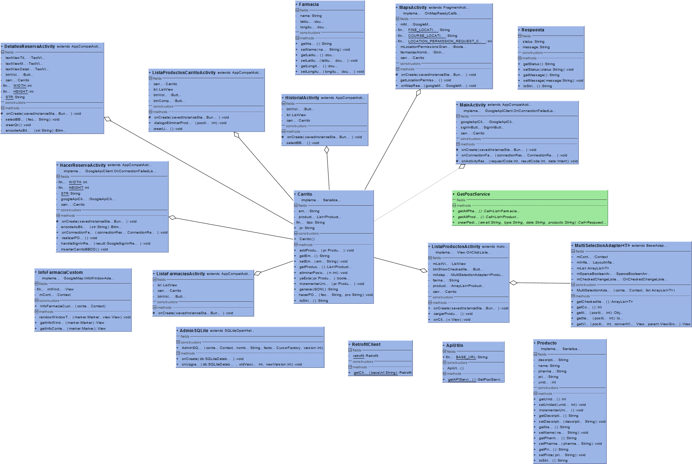
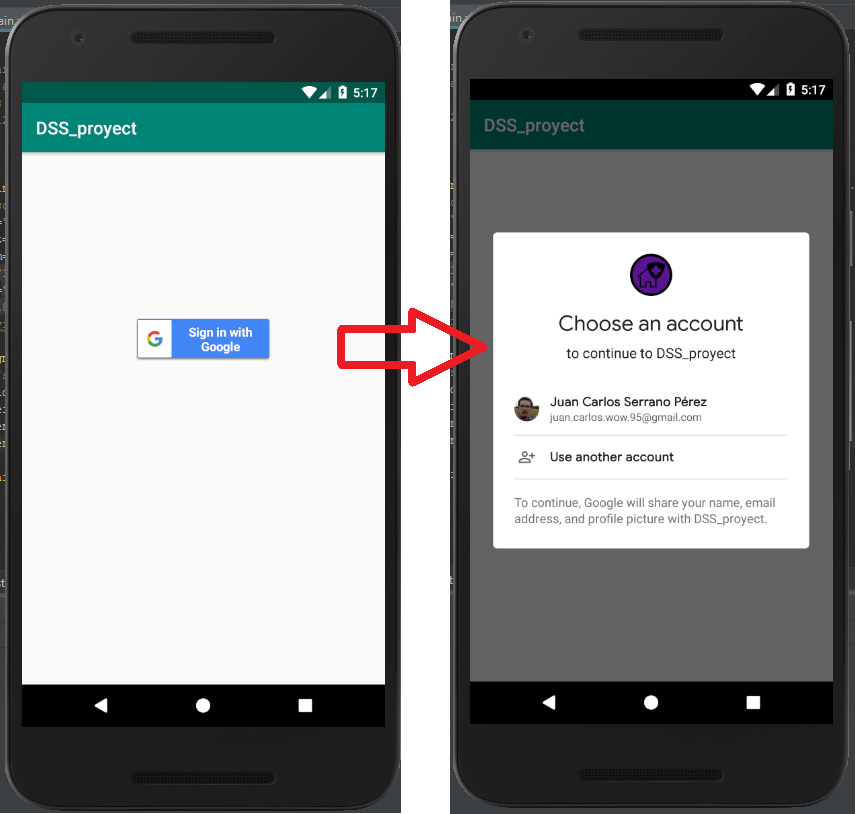
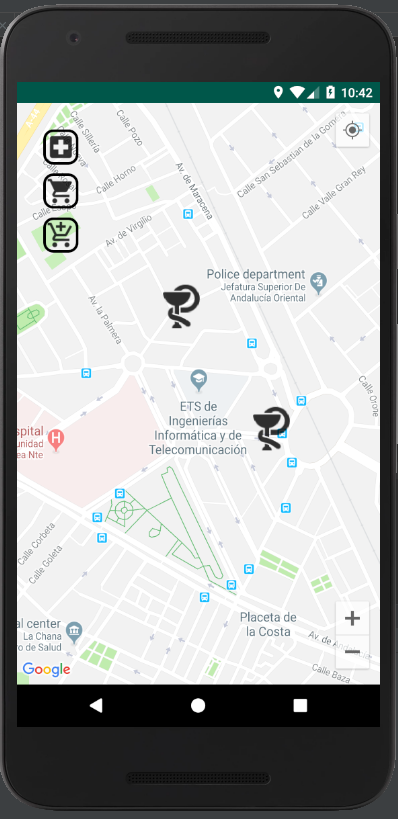
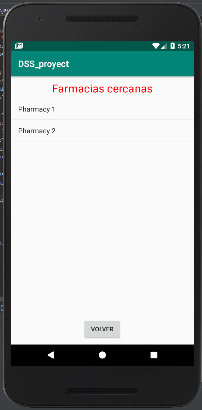
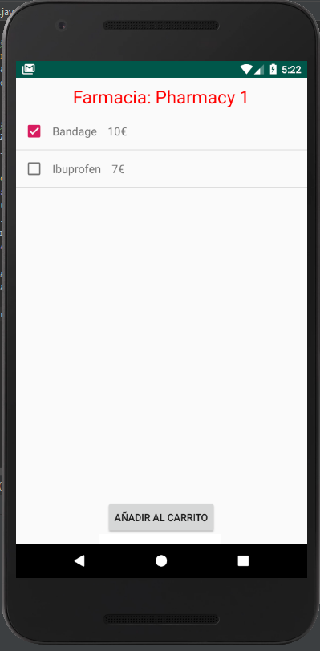
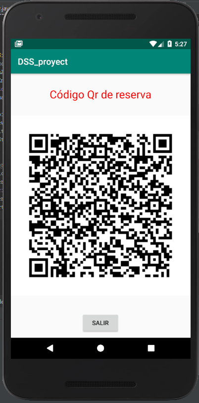
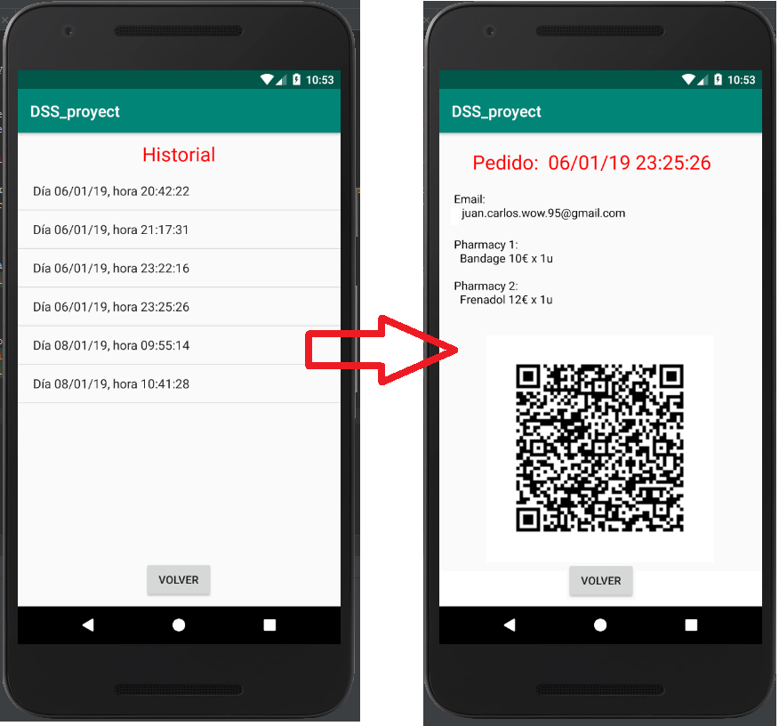

# Aplicacion Android maps receptiva y adaptable

Desarrollo completo de una aplicación receptiva y adaptable para dispositivos móviles y su interfaz Web RESTful. Desarrollo del servicio y base de datos en la parte servidora

To book drugs (listed in the inventory of a consortium of pharmacies) through a smartphone is currently an issue in the e-commerce and pharmacy business. This problem also includes that an app will be able to manage geographic information that allows the location of nearest pharmacies to the current location of the user. In addition, when the client runs the app from a mobile device (smartphone, tablet, etc.), he  will be allowed accessing to the drug catalogue through a browser with a description of the drugs in stock.

Problem setting:

Complete development of an app in Java/Android or C++/IOS (client part), which allows app users to search a drug in the disclosed catalogue of a consortium of pharmacies. The application will easily integrate with standard geographical location applications (e.g.: Google Maps). 

Finally, a version of the app as a Web application that will allow the pharmacy or an authorized dealer to access the pharmaceutical products catalogue and to download the app from the Web site will be implemented.

## Diagrama UML

## Funcionamiento

Inicialmente la app mostrará una actividad para iniciar sesión a través de una cuenta de Google. Una vez seleccionada la cuenta que se desee se pasará a la actividad central de la aplicación.

En esa actividad se nos marcará en el mapa las distintas farmacias y podremos ver información específica como su dirección, teléfono, página web u horario de apertura, también podemos solicitar que nos guíe hasta allí.

En esta actividad, en la zona superior izquierda encontramos tres botones:
1. Superior: nos llevará a la lista de farmacias cercanas.
2. Central: nos llevará al carrito donde poder ver los productos ya seleccionados.
3. Inferior: nos llevará al historial de reservas realizadas.

Como se ha mencionado si seleccionamos el botón superior iremos a una actividad similar a la siguiente en la que aparecerán las distintas farmacias por orden de cercanía y podremos elegir la que se desee.

Una vez seleccionada la farmacia pasaremos a una lista de multiselección del inventario disponible en la farmacia seleccionada. Una vez seleccionados los productos los añadiremos al carrito y volveremos a la actividad central del mapa.

En la actividad central del mapa, si pulsamos el botón central iremos a la actividad encargada de mostrarnos el contenido del carrito. En ella podemos ver una lista de los elementos que hemos añadido, las unidades y el precio total.

En caso de no desear un producto lo podemos seleccionar y se nos mostrará un diálogo preguntándonos si queremos eliminarlo del carrito.

Una vez pulsamos el botón comprar se procederá a hacer la reserva de los productos e iremos a una nueva actividad  en la que se nos mostrará un código Qr como el siguiente a modo de recibo que contiene elementos como nuestro email, tipo de transacción, fecha en la que se ha realizado y el contenido del carrito.

Nuevamente en la actividad central de la aplicación, si pulsamos en este caso el botón inferior iremos a al historial de las reservas realizadas y podremos ver los detalles de la reserva.

## Video

Puede encontrarse un video del funcionamiento de la app en el siguiente [enlace](https://www.youtube.com/watch?v=yHRL6B2Xp1Q&feature=youtu.be)